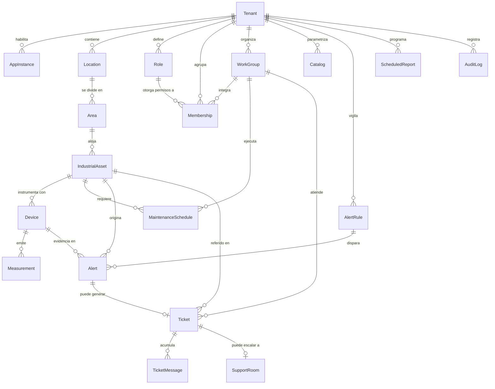

# CIMEDI — Modelo de datos

App Base44: **CIMEDI** (`6a735807590e7614f7fcdca7`). 19 entidades más el `User` extendido.
Todas las entidades de negocio llevan `tenant_id` y seguridad a nivel de fila (RLS) en el backend.

## Diagrama entidad-relación



## Entidades

### Núcleo multi-tenant

| Entidad | Propósito | Campos clave |
|---|---|---|
| `Tenant` | Empresa o dependencia. Raíz del aislamiento. | `name`, `slug`, `status`, `accent_color`, `theme`, `public_status_enabled`, `plan` |
| `AppInstance` | Instancia de producto habilitada por empresa (multi-app). | `kind`, `key`, `enabled`, `is_default`, `order` |
| `User` (extendida) | Preferencias y contexto activo. **Sin contraseñas**: la identidad la maneja el proveedor de auth. | `active_tenant_id`, `tenant_ids`, `theme`, `accent_color`, `language`, `favorites`, `visible_modules` |
| `Membership` | Pertenencia usuario ↔ empresa, con rol y equipos. | `user_email`, `role_id`, `role_key`, `workgroup_ids`, `visible_modules`, `status` |
| `Role` | Matriz de permisos granulares por módulo. | `key`, `level`, `permissions` (mapa módulo → CRUD+export) |
| `WorkGroup` | Cuadrilla operativa. | `member_emails`, `leader_email`, `specialty`, `color` |

### Jerarquía de activos

| Entidad | Propósito | Campos clave |
|---|---|---|
| `Location` | Estado → Región → Municipio → Localidad → Colonia. | `abbreviation`, `estado`, `region`, `municipio`, `localidad`, `colonia`, `lat`, `lng`, `health` |
| `Area` | Área operativa dentro de la locación. | `location_id`, `code`, `responsible_email`, `workgroup_id`, `health` |
| `IndustrialAsset` | Unidad central: agrupa dispositivos, mantenimientos y alertas. | `area_id`, `location_id`, `asset_type`, `criticality`, `health`, `health_reason`, `qr_code`, `groups` |
| `Device` | Sensor IoT. Puede emitir **varias sub-variables**. | `eui`, `mac_address`, `protocol`, `channels[]`, `zero_adjust`, `multiplier`, `sample_interval_seconds`, `last_seen`, `last_value` |
| `Measurement` | Serie de tiempo. Alto volumen. | `device_id`, `ts`, `channel`, `value`, `raw_value`, `quality`, `source` |

`Device.channels[]` existe porque un mismo sensor reporta más de una magnitud: el medidor de nivel
del inventario real entrega Volumen (m³) y Porcentaje (%) simultáneamente. Cada canal lleva su
unidad, decimales, umbrales y escala de gauge; el canal marcado `primary` alimenta el semáforo.

### Operación

| Entidad | Propósito | Campos clave |
|---|---|---|
| `MaintenanceSchedule` | Plan preventivo recurrente. | `frequency_unit`/`frequency_value`, `next_due`, `last_maintenance`, `reminder_type`, `reminder_channels`, `status` |
| `AlertRule` | Condición vigilada y su despacho. | `scope`, `operator`, `threshold_min/max`, `severity`, `channels[]`, `cooldown_minutes` |
| `Alert` | Evento disparado. | `rule_id`, `severity`, `message`, `value`, `status`, `acknowledged_by`, `delivery_status` |
| `Ticket` | Mesa de ayuda con SLA. | `folio`, `priority`, `sla_hours`, `sla_due`, `sla_breached`, `status`, `first_response_at` |
| `TicketMessage` | Historial del ticket. | `ticket_id`, `body`, `is_internal`, `event_type` |
| `SupportRoom` | Videollamada agendada. | `access_key_hash` (SHA-256), `access_key_hint`, `scheduled_at`, `meeting_url` |
| `Catalog` | Maestros genéricos editables. | `catalog_type`, `key`, `label`, `symbol`, `color`, `order` |
| `AuditLog` | Bitácora append-only. | `entity_name`, `action`, `actor_email`, `changes` (diff), `ts` |
| `ScheduledReport` | Informe periódico por correo. | `report_type`, `format`, `frequency`, `send_hour`, `recipients[]` |

## Aislamiento por empresa (RLS)

Regla aplicada a las entidades de negocio:

```json
{
  "read":   {"$or": [{"data.tenant_id": "{{user.data.active_tenant_id}}"},
                     {"user_condition": {"role": "admin"}}]},
  "create": { "…igual…" }, "update": { "…igual…" }, "delete": { "…igual…" }
}
```

Consecuencias de diseño:

- **La empresa activa del usuario es la llave.** Cambiar de empresa en la consola escribe
  `active_tenant_id` en el perfil, así que el aislamiento se mueve con él. No es un filtro visual.
- **Ni el rol más permisivo cruza empresas.** La matriz de permisos decide qué puede hacer alguien
  *dentro* de su organización; el RLS decide *qué organización* puede ver.
- **Excepciones deliberadas:** `Tenant` es legible por cualquier usuario autenticado (para poder
  listar a cuáles pertenece) y escribible solo por el propietario de la instalación. `Membership`
  añade `data.user_email == {{user.email}}` para que cada quien vea su propia membresía.
- **`AuditLog` es append-only:** sus reglas de `update`/`delete` no coinciden con ningún rol real.
- **Deuda conocida:** el `user_condition: admin` es la vía de escape que evita dejar una
  instalación sin administrador. En despliegue productivo conviene sustituirlo por un rol de
  servicio dedicado y auditado.

## Volumen y series de tiempo

`Measurement` es la única entidad de alto volumen. Reglas de uso vigentes en el código:

- Toda consulta va acotada por `device_id` **y** rango de `ts` (nunca un `list()` completo).
- Los dispositivos guardan `last_value`/`last_seen` desnormalizados para que listados, semáforo y
  mapa no toquen la serie.
- Un dispositivo multicanal genera una fila por canal y por instante; el visor filtra por `channel`.

Cuando el volumen lo pida, la migración natural es mover `Measurement` a una tabla particionada por
tiempo o a un motor de series temporales, conservando el resto del modelo intacto: ninguna otra
entidad depende de su almacenamiento físico.
